# XRPG

XRPG written with love by CalliopeX ([Tumblr](cumaddictjess.tumblr.com)) ([Twitter](twitter.com/cumaddictjess))

> Thanks so much to the lovely people of the Kuroinu discord for helping me make this best version of XRPG yet a reality! I love you. —CalliopeX

<!-- START doctoc generated TOC please keep comment here to allow auto update -->
<!-- DON'T EDIT THIS SECTION, INSTEAD RE-RUN doctoc TO UPDATE -->

- [Introduction](#introduction)
- [Basic Mechanics](#basic-mechanics)
- [Characters](#characters)
  - [Attributes](#attributes)
  - [Resources](#resources)
  - [Hitpoints](#hitpoints)
  - [Traits](#traits)
  - [Magic](#magic)
  - [Class and Race](#class-and-race)
  - [Beyond Level 1](#beyond-level-1)
  - [Equipment](#equipment)
- [Magic and Spellcasting](#magic-and-spellcasting)
  - [The Five Schools](#the-five-schools)
  - [Spell Types](#spell-types)
  - [Spell Lists](#spell-lists)
- [Encounters](#encounters)
  - [Creatures](#creatures)
  - [Damage](#damage)
  - [Loss](#loss)
  - [A Sample Combat](#a-sample-combat)
- [Reference](#reference)
  - [Level XP Table](#level-xp-table)
  - [Trait Trees](#trait-trees)
  - [Spell Trees](#spell-trees)
  - [Equipment](#equipment-1)

<!-- END doctoc generated TOC please keep comment here to allow auto update -->
<!-- npx doctoc --notitle --maxlevel 2 docs/xrpg-rules.md -->

# Introduction

XRPG is an adult role-playing game designed to be played easily over a long period of time via any Instant messaging program. Any number of players can take part, but it is important to balance the number of players with the number of people willing to run and design encounters for them. There is no hard number to the number of players that can play, but it is recommended to have at least one extra Encounter Player for every player. Unlike traditional tabletop RPGs, there is no respect to a party system. It’s envisioned as the tale of a single adventurer who has for one reason or another delved into this land of monsters, though you may, depending on the circumstance, group up to take a particularly difficult quest. All you need to play is the following:

**The GM, or Game Master.** The GM is the person responsible for designing and dictating the setting. They oversee the overarching plot, if there is one, and the layout of the world. GMs usually also participate to run encounters for players, the same as an Encounter Player would. It is the GM’s responsibility to keep tabs on if people are cheating or abusing the system, and to help new players understand both the world and the rules governing gameplay.

**The Players.** No RPG is complete without participants. Players run their own characters, role-playing and putting them through dangerous or erotic situations. Whether that is entering a dungeon, exploring a swamp, or seeking the aid of a wise old hermit. Players maintain their own character sheet and govern the actions only of their own single character. Within the XRPG system there is no reason why a player cannot participate as two separate characters, even to run a party solo is acceptable but not the original intent for the game. Much of this book is written to detail to the players how to create these characters. It is important when considering your character to try to keep an open mind to the kinds of things the game will throw at them. Being promiscuously natured, trying and accepting new things is a necessary trait to the gameplay. People who are strictly straight or turned off by monstrous encounters will find their characters either put through things extremely adverse to their tastes, or will have to opt out and straight up die.

**The Encounter Players.** Expecting one GM to run every scenario for more than perhaps two players would be a large undertaking and cost a lot of time. The Encounter Players are people who design and orchestrate the encounters while obeying the rules and laws set by the GM. Encounter Players describe settings and play the part of every nonplayer character being in the encounter, and so will need to be quick fingered and open-minded to the kinds of things they are expected to portray. It is important to mention that the purpose of the encounters is not to kill or force the players to lose against unwinnable scenarios, but merely to facilitate fun and interesting locations and creatures. It is also generally a polite gesture to try to accommodate the player to their own preferences kink wise, though it is far from a sin to try to push the envelope a bit.

_An adventurer might aid a lost succubus by allowing her to use him to replenish her Mana. XRPG allows for many kinds of lewd and perverted scenarios while trying to present a unique and fun ruleset for RPG veterans._

The game itself consists of a series of encounters, contrasted with off-time from adventuring. For example: our player is a slutty elf named Awyn. She departs from her home camp to travel through the woods for a while. She may or may not find a creature on her way through the woods, or a creature may find her, depending on the circumstances of that encounter, at the decision of either the Encounter Player or the GM, to outline the setting. The two combatants then have a series of moves and rolls to make to decide who the victor is of the carnal predicament. If Awyn is defeated, the creature then proceeds to ravage her for a time until she passes out and wakes up back at camp or still stranded in the jungle. Alternatively, if Awyn is the victor, she gets the choice to either fuck the creature; upon which causing it to orgasm will reward her with XP and a return of one HP (detailed later). Or she may slay the thing or cast it aside, being rewarded with the same XP but lacking any kind of recoup sex would generate. Then she may carry on or return to camp to further recoup lost energy. It is important to add that an encounter won’t always be won by “defeating” the creature’s roll. Sometimes it is presented in a manner of “surviving” whereas even if Awyn defeats the roll of a Minotaur, she is not in control of the situation and is merely able to survive the beast’s throbbing cock.

# Basic Mechanics

**Advantage and Disadvantage.** When the rulebook calls for either advantage or disadvantage, it is asking you to make two rolls of whatever dice you happen to be using, including any bonus die, and use either the better or worse of the two rolls. Better if it is under the effect of advantage, worse if under disadvantage.

**Bonus.** When the rulebook calls for a bonus, what it is asking for is to roll whatever die is dictated for the roll again and add it to your standard roll. For example, dual weapons come with a bonus to Athleticism rolls, so instead of rolling 1d4 at level 4 you would be rolling 2d4. (more on this detailed later)

**Dice Shorthand.** When reading numbers that represent dice rolls, there are two parts to the shorthand. The first number represents how many dice should be rolled, and the second number represents how many sides there should be on that die. For example, 1d4 means you should roll one four-sided die where 3d20 means you should roll three twenty-sided dice.

# Characters

## Attributes

Attributes are the numbers that determine what a character is good or bad at. They are also the first things to consider when creating a character. All characters have a balanced sum of the five attributes to their level, when first creating a character you select a balance which decides on how many points of each attribute you will gain per level. This is called your attribute growth. For players your attribute growth cannot be higher than 1.25 per level or lower than 0.75, you can, however, select any decimal between the two. Attribute growth for all five attributes additionally must sum up to a total of 5, the same as the number of attributes to pick from.

**Athleticism.** Your direct physical ability, agility, strength, and defence. Athleticism governs your ability to lift heavy objects and survive or defend from physical trauma.

**Charisma.** Interpersonal skills. Charisma governs your ability to flirt and haggle, and your ability to charm creatures with either your words or body.

**Endurance.** Length of energy. Separate from Athleticism, but in a similar vein, Endurance governs how long your body can expend energy before weakening to fatigue. Endurance governs your amount of Stamina.

**Sorcery.** Magical energy and ability. Sorcery is both your modifier for spellcasting and arcane arts and the depth of your Mana pool. Any person who empties their soul of Mana is also subject to extreme fatigue and weakness.

**Willpower.** Ability to resist magic and charismatic temptations. Willpower governs your mental fortitude against many kinds of manipulation and is also the source of Resolve, a resource spent when defending against psychic attacks.

_A mighty barbarian would prioritize Athleticism and Endurance, focusing on raw physical strength to overcome opponents. Yet, she would be weak to any monster with an ability to affect her mind._

## Resources

**Stamina.** Governed by the Endurance attribute, Stamina functions as a limit on the physical actions a character can undertake before they become completely fatigued. Stamina’s value is 10× the character’s Endurance after modifiers.

**Mana.** Governed by the Sorcery attribute, Mana is the amount of magical energy a body has to offer before the character is completely exhausted. Mana’s value is 10× the Sorcery attribute after modifiers.

**Resolve.** Governed by the Willpower attribute, Resolve is the amount of energy the mind has remaining before it becomes suggestible. It is used to cast certain magics, and its value is 10× the Willpower attribute after modifiers.

### Elasticity and Equip Load

**Equip Load** governs the amount of equipment any character is allowed to carry with them at any given time without expending Stamina to maintain. It is determined by the player’s Athleticism growth and is unchanging irregardless of level, though it can be increased by purchasing bags and other objects that assist the character with transport of goods. Equip Load’s value is 10× the Athleticism growth of a character + 3.5 rounded down. This means the minimum Equip Load is 11 while the maximum is 16.

**Elasticity** is a stat that determines how easily a character can handle being penetrated without suffering damage. For every point tighter a character is than the value of the object penetrating them, they lose −1 on a roll of 1d4. A result of 1 or less results in the character taking one damage, a result of −4 or less results in the character taking two. Elasticity is dependent on a player’s Charisma growth, the value is 5× Charisma growth −4. A minimum score is −0.25 and the maximum natural score is 2.25.

## Hitpoints

All creatures and players have Hitpoints or hearts. All players begin with 3 Hitpoints and only gain more under special circumstances.

## Traits

Traits or perks are upgrades determined by progression down a series of branching trees detailed later in the book. Right off the bat, you are granted one trait for your race and one trait for your class or background. Otherwise, these things have no effect but aesthetics, work with your GM to determine what traits would make the most sense to the character you have chosen to create. Traits selected as a product of character creation can come from anywhere inside a tree, but otherwise they must be purchased in order. Having started a tree does not mean you need to finish it, and you can have as many trees ongoing as you like.

## Magic

Every character begins the game with a single school of magic and a single spell, unless their background or class allows them to select another. You can learn new spells via training with a senior wizard or by reading from a spell-granting item. It costs one perk point to learn each spell, so long as it is within a school of magic you have mastered. If the spell is outside your magic school, it will cost three times as much to learn. Casting any kind of spell will draw Mana from your body, there are three kinds of different spells, each with slightly different rules for how much it will cost to cast them.

## Class and Race

Contrary to the precedent set by most tabletop roleplaying games, in XRPG selecting your class and race is much more important to your character’s background and personal appearance than it is to the actual stats. Class and race still affect characters, but not nearly as significantly as they would in most other RPGs. Both your class and race selections have nothing to do with stats. They manifest themselves by allowing you to gain two free traits at level 1 from any depth of any tree, so long as they are acceptable to the GM running the campaign. Work together with your GM to decide what perks will be available for what race or class description.

## Beyond Level 1

At every subsequent level beyond the first, your character gains in might and ability. The game begins at level 1 and ends at level 111. Your attributes increase by your attribute growth every level, you can easily calculate this by multiplying the two together. Additionally, every few levels, something called your Level Die increases in accordance to the variation of minimum and maximum stats. The Level Die determines the standard die for rolls at each level, Every attack made, with the exception of spells where you can choose the strength of the attack, is made with this die.

| Levels  | Die  |
| ------- | ---- |
| 1–9     | d4   |
| 10–19   | d10  |
| 20–40   | d20  |
| 41–60   | d30  |
| 61–99   | d50  |
| 100–111 | d100 |

You also gain one point to be used on either the purchase of a new trait or spell every level. These, unlike for class and race, must be spent on spells or traits in order of the tree. You must purchase a preceding trait or spell prior to one later on. You may however jump back and forth across as many trait trees as you like. Trait trees are found in the Reference section later in this book.

### Things gained every level

- 1 trait/spell point
- Add attribute growth value to all 5 attributes
- Sense of self-worth

## Equipment

Characters typically wear equipment that helps them in combat. There are three main types of equipment, armour, weapons, and accessories. Armour is a covering of the body that adds to the Defence stat and protects the wearer from damage. Weapons are tools used to inflict damage on the opponent, and accessories can be anything from jewelry with magic properties to a shield that assists in defence. Be aware that many hostile creatures you will meet on your journey can also be equipped with natural or crafted gear in the likeness of your own.

### Materials

All Equipment is made from some kind of material, the material it is created from dictates the abilities and limits of any set of armour or weapon. Tribal tech weapons like wooden spears and hide armour like loincloths, drapes etc, can only be used at a very rudimentary level and cannot be upgraded very far. However, an armour created with a mythic material like mithrill can be so fine-tuned and worked on that it ascends past the level of any ordinary armour. Most Armours and weapons in an average game will rest below mythic gear and more in the sensible metals and compositions like bronze and iron. Within a similar group of materials each has a difference balance of weight and durability, heavier equipment always lasts longer than lighter ones in combat but are more difficult to travel with. Certain materials can only be used to create armour, while others are only useful in weapons.

### Archetypes

Archetypes describe the design of each armour set or weapon, any archetype can be made of any material. The archetype of each piece determines the piece’s strengths and weaknesses. For example, plate armour is famous for its ability to ignore and shrug off more damage than any other set, but it heavily limits the strength you can swing with and the amount of energy you have left to spare. The archetypes of armours and weapons are detailed separate from each other and provide different kinds of trade-offs. All equipment that maintains a bonus in one stat will have a malus in another to balance out. Bonuses are 10 percent (10%) of the selected attribute, and maluses are the same number added via the bonus removed from the other attribute. In the case of multiple maluses and no attribute bonus, the malus attribute with the media value is reduced by 5 percent, and that same number is removed from the other malus attributes.

### Accessories

Accessories are small trinkets, jewelry or magic items cast onto your equipment that can deliver a wide variety of benefits to the wearer. So many variations on trinkets exist that we aren’t even going to try to cover them in this book, use your imagination GMs, and it will come to you!

# Magic and Spellcasting

Magic is the lifeblood of high fantasy. In XRPG every character has some affinity to arcane energy and their own pool we call Mana. From hurling mighty fireballs to tricking the minds of the foolish, magic is a solution to nearly any problem. Spending a sufficient amount of Mana can move mountains and shape worlds. Mana determines the amount of arcane energy any creature has; a drained reservoir of Mana usually results in the creature fainting until the levels return naturally. All creatures regain Mana slowly naturally, pulling a little of the arcane power from the earth every day. But to be a true magical caster you must find a way to rapidly replenish Mana or you will be caught without energy to combat with. Several of the perk trees have traits that permit this, or you can purchase potions of raw arcane energy, or Mana potions for short.

## The Five Schools

**Alteration.** The school of Alteration specialized in physical transformations, changing your body and the world around you. From repairing your very flesh to freezing the floor under an opponent’s feet, this school has the widest variety of actions possible.

**Enchanting.** The school of Enchanting is specialized in both illusion and charm. Editing the perception of those standing nearby and flickering in and out of reality. Charming opponents to do your bidding and binding them to your control.

**Invocation.** The school of Invocation focuses on raw elemental control. Using the powers of the elements to destroy opponents, with some Mana tricks worked into it. Invocation is a school of destruction, pure, straightforward, simple.

**Purification.** Purification is the odd one out of all five schools, based on faith and belief in the gods. Purification focuses on empowering your own physical abilities with tricks of utility to remove any kind of evil from the land.

**Summoning.** The School of Summoning is plainly concerned with the creation or relocation of other entities or objects to assist or fight in your place. From demons to golems to nature spirits and sprites, even magic weapons are available to those with the talent.

## Spell Types

**Attacks.** Spells listed as attacks are spells that add no modifiers and have few miscellaneous effects. They are simple contest rolls following the characteristics of the spell itself. Unless otherwise noted, all attack spells effects are to deal one damage to the target. The total Mana cost of an attack type spell is the target’s Sorcery score plus the average roll of the die chosen. Note, the name of the spell is determined by the size of the die rolled.

| Die  | Name    |
| ---- | ------- |
| 1d4  | Bolt    |
| 1d8  | Blast   |
| 1d12 | Wave    |
| 1d20 | Surge   |
| 1d30 | Storm   |
| 1d60 | Tempest |

**Bonuses.** Spells listed as bonuses are spells that add a bonus die (same as the current Level Die) onto an ordinary roll. The specifics and limitations of each bonus spell are listed in its description in their entirety. The total Mana cost of a bonus spell is equal to the average roll of the Level Die multiplied by 2 plus the floor of the roll. The name of the spell is determined by the Level Die rolled as a result of the spell.

| Die   | Name      |
| ----- | --------- |
| 1d4   | Petty     |
| 1d10  | Minor     |
| 1d20  | Lesser    |
| 1d30  | Greater   |
| 1d50  | Grand     |
| 1d100 | Legendary |

**Miscellaneous.** Spells listed as miscellaneous are spells with effects that don’t fall under the other two categories. The complete details of each spell are listed in their entry. The Mana costs of a miscellaneous spell are, unless otherwise specified, four times the level of the target. The names for miscellaneous spells are the same as for g spells.

## Spell Lists

### Alteration

**Strengthen Body.** (Bonus) Adds a magic die to defensive rolls against a physical attack, or bonus to a physical feat. “Magically charge your body with extra energy to weather an assault or complete a feat of athletics.”

**Augment Mind.** (Bonus) Adds a magic die to defensive rolls against a psychic attack. “Fortify your mind with a magic influx to defend from probing attacks against it.”

**Fatigue.** (Attack) Deals Stamina damage equal to 10×roll. “Drain your opponent of stamina, rendering them exhausted to any follow-up.”

**Ice Path.** (Miscellaneous) Lower the target’s Athleticism score by its Level Die while within the area. “Coat the floor with ice, causing your opponent to slip and slide while it magically remains normal terrain for you.”

**Mend.** (Miscellaneous) Return Stamina to yourself equal to your roll×15. “Channel magic energy to quickly reshape your body to its normal state and repair some damage.”

**Morph.** (Attack) Give target one body-based perk for 6 hours. “Channel magic into editing a physical characteristic on the target’s body.”

**Poison Splash.** (Attack) Deals Stamina damage equal to 7.5×roll. Continues to deal damage after caster is incapacitated. “Douse your opponent in a toxin that either causes physical damage or drains the energy from their veins. This effect stays in effect without concentration.”

**Wild Shape.** (Miscellaneous) Shapeshift into the body and stats of one animal that you have previously encountered. “Reform your body temporarily into that of a beast, drawing the details from memory. Requires meeting the animal at least three times.”

### Enchanting

**Blink.** (Miscellaneous) Evade one attack with a short teleport. “Step into an alternate dimension for fifteen seconds and instantaneously re-appear within a short distance of where you stepped out from.”

**Charm.** (Bonus) Adds a magic die onto a single flirt or allure type roll. “Magically enhance your appeal and affect the target’s mind to find you even more irresistible than usual.”

**Dispel.** (Miscellaneous) Removes a magic buff or de-buff, must be cast with equal level of the spell targeted. “Create a field of magic energy that counteracts and nullifies a previously planted spell and dissolves it.”

**Dominate.** (Attack) Instant charm incapacitation, spell modifier must double out opponent’s Willpower. “Enter your target’s mind and warp it. Ruin them to anyone else and render them nothing but a puppet to you. An advanced spell to pull off properly.”

**Barrier.** (Bonus) Adds a magic die to physical and Sorcery defence. “Create a magic barrier to protect against physical and magic attacks.”

**Illusion.** (Bonus) Adds a magic die to deceit rolls based on location or appearance or to defence against physical attacks. “Create an illusory image either around you or someplace nearby and try to fool your enemies or confuse them.”

**Illusory Assault.** (Bonus) Adds a magic die to physical attack. “Create a set of tangible illusions and attack your opponent from all angles. Forcing them to guess which one is actually you.”

**Afterimage.** (Miscellaneous) Negates the damage of one attack. “Create an afterimage once attacked and step out of the way so that the attack passes harmlessly through your illusion.”

### Invocation

**Banish.** (Miscellaneous) Instantly destroy a summoned entity, must double out its Sorcery, must be cast at the same level as the summoned entity. “Overload the spirit with a charge of pure elemental energy and force them back into their original plane or form.”

**Clarity.** (Miscellaneous) Regain Mana equal to your roll×15. “Use a jolt of magic energy to break into the astral plane and channel back a sum of energy greater than what you spent.”

**Meteor Strike.** (Attack) Instant magic or physical attack success, must double out with Sorcery attack roll. “Bring down a magic meteor to strike the foe and impact the very earth on which they stand.”

**Maelstrom.** (Attack) Instant Willpower or Stamina success, must double out with Sorcery attack roll. “Cast a magic storm or cyclone to travel in front of you and toss the opponent or shred their belongings.”

**Air Missile.** (Attack) Magic missile vs Stamina. “Blast the target with a continual gust of wind, they must persevere or be knocked flat and winded from the force.”

**Earth Missile.** (Attack) “Blast the target with an enchanted boulder, smashing into them to cause physical damage.”

**Fire Missile.** (Attack) Magic missile vs Sorcery. “Blast the target with a mote of flame and force a barrier to defend against the heat and fire.”

**Water Missile.** (Attack) Magic missile vs Willpower. “Surround the target with water and suffocate them, those with no Resolve will fall to their knees airless.”

### Purification

**Enrapture.** (Attack) Prevents creature from taking specific actions against you. Cast with Willpower. “Reach in and force a block in the target’s mind, leaving them incapable of conducting normal actions.”

**Focus.** (Miscellaneous) Regens roll×5 Resolve. “Meditate briefly and return your resolve, refreshed for the next test.”

**Fortitude.** (Bonus) Adds a magic die to defend against psychic attacks. Cast with Willpower. “Focus on your strength of will and weather the storm of mental punishment.”

**Lightning Bolt.** (Attack) Magic missile cast with Willpower vs Sorcery. “Hurl a bolt of lightning and fry your opponent with radiant energy.”

**Mana Burn.** (Attack) Reduce the target’s Mana by 10×roll, cast with Willpower. “Tap into your opponent’s reservoir of mana and burn it away to weaken the power of wizards.”

**Smite.** (Bonus) Adds a magic die for physical attacks, cast with Willpower. “Your strength of conviction fuels your body and with a surge of holy energy cast your enemy down.”

**Terrify.** (Attack) Reduces target’s Resolve by 10×roll. “Overwhelm your opponent with your determination, make them unsure of themselves by sheer force of will.”

**Ward.** (Bonus) Adds a magic die to physical defence, cast with Willpower. “Create a holy barrier to protect against outside aggressions from beasts and the unclean.”

### Summoning

**Aether Step.** (Miscellaneous) Temporarily shift planes and gain the Ethereal trait. “Step out of the boundaries of the mortal plane and become intangible to physical attacks and the similar for a time”

**Arcane Circle.** (Miscellaneous) Summon a being from another plane, Demons and similar. Rules dictated by creature summoned. “Using a magic circle specifically inscribed on the ground; call forth a powerful demonic creature and negotiate with it by the rules incorporated in the individual’s arcane bonds.”

**Call Guardian.** (Miscellaneous) Summons a being from the terrestrial world. Rules dictated by creature. “Using a nature altar, call forth an arcane being or beast from the world around you and negotiate it using common sense and logic.”

**Conjure.** (Miscellaneous) Creates a being from materials around, undead are the normal choice. Spirits second. The summoned entity is automatically enthralled by you. “Use nearby remains and other items to create a follower to do your bidding.”

**Create Elemental or Golem.** (Miscellaneous) Creates a golem or elemental from a nearby element, enthralled by you. “Use a natural formation around you to magically build a magic construct to do your bidding.”

**Portal.** (Miscellaneous) Creates a portal that allows an ally to step through and come to your aid. “Rip a tear in the air in front of you to any location you wish, and call an ally through to help you fight.”

**Sorcerous Shield.** (Bonus) Summons an arcane shield that adds a magic die to physical and arcane defence rolls. “Create a shield of pure sorcerous energy called forth from another dimension to wield.”

**Sorcerous Weapon.** (Bonus) Summons an arcane weapon that adds a magic die to physical and arcane attack rolls. “Create a weapon of pure sorcerous energy called forth from another dimension to wield”

# Encounters

While journeying across a world like this, it is impossible not to come into contact with a wide variety of creatures and people. Thieves, monsters, militias all included. The world is full of a massive range of possibilities, and many diverse kinds of life. Encounters are what happens when a character is put into any kind of scenario where they must roll or use skills to overcome an obstacle, usually as an outcome of meeting a creature of some sort. These situations are always run by an Encounter Player or the GM and are the bread and butter of XRPG. All encounters rest on a competition versus another being or against nature itself to see if the character or the opponent comes out on top. Some encounters will take all the resources a player has available to come out on top. Encounters and rolls are divided into three main types.

**Attrition.** This is when the player is pitted against an opponent that seeks to wear them down, like a group of weaker/smaller creatures or a writhing mass of tentacles. Attrition is a race against time, depending on the type of encounter it can primarily consume either Stamina, Mana, or Resolve. If the player is not able to incapacitate their opponent before drained of any of the three resources, then they are defeated. Likewise, incapacitating the opponent will result in the character’s success. Examples of a Stamina attrition combat is a mass of tentacles with the character bound by and resisting them. Something such as an elemental requires a magic barrier to not injure the one they are fucking would be Mana attrition, and the Ilithids are best known for inflicting Resolve attrition through their Mind Flay ability.

**Contest.** This is when the stat of a creature is in direct competition with that of the players. The two have a roll-off and the higher result of the Level Die + relevant characteristic is declared the winner. In the case of the numbers being equal, the higher decimal value is taken into account. Typically, there are four main contests that occur. Sorcery vs Sorcery, when two magic-users engage in a magic duel. Athleticism vs Athleticism, when there is a combat of physical ability or someone is just trying to survive the ordeal another is putting them through. e.g., fighting another human being vs being impaled by a minotaur. Charisma vs Charisma, where a character is attempting to trick/wile/flirt your way through someone’s guard to bed them. And Charisma vs Willpower, when someone is trying to entice or invite another to fuck them through an erotic display or other means that ought to be resisted. Depending on the kind of attack attempted, the result can be to reduce the opponent’s resources towards zero or to deal enough damage in head on combat to defeat them.

**Test.** This is generally for magic or alchemical concoctions. The most common is Willpower vs spell DC (Difficulty Check, an arbitrary number given to mark the effectiveness of a spell). The person targeted must use Willpower, or sometimes Sorcery, to deflect or ignore the effects a spell or potion may have on them. Typically, failing one of these isn’t an instant loss of an encounter, but it can result in one.

## Creatures

Any number of creatures can be encountered in a fantasy world, with any number of special abilities that make them each a unique challenge to overcome. From vampiric traits to a strong natural musk, any adventurer caught unprepared could easily fall victim to these tricks. Some creatures have their own feats like characters do that are unobtainable to most players while others have the ability to inflict debilitating status effects, also included under status effects are the penalties to losing a combat.

### Status Effects

- **Poisoned.** Damages Stamina over time, rate of decay depends on the creature inflicting it.
- **Charmed.** Caught in the charms of another creature, must defeat their Willpower in order to break free and regain control.
- **Pregnant.** No effect for 20 days, on day 21 lose 25% of maximum Stamina for 10 more days.
- **Injured.** After losing one encounter −10% less resources of all kinds.
- **Wounded.** After losing a second encounter −30% less resources of all kinds.
- **Addicted.** −1 to Willpower rolls versus the particular addiction, stacks infinitely. Every successive failure when encountering the same addiction adds −1 cumulatively. If the roll to overcome addiction becomes impossible, Bad end.
- **Pinned.** 2× multiple to resource costs while trapped by opponent.
- **Aroused.** Overtaken by lust, 2× multiple to all Resolve costs.

### Creature Feats

- **Addicting.** Pass a Willpower contest roll or become Addicted.
- **Allure.** Bonus to Charisma rolls to entice or charm.
- **Amorphous.** Invincible to physical damage.
- **Animal Husbandry.** May tame pacified beasts to use at camp.
- **Arcane Ebb.** Minus to spells cast.
- **Arcane Flow.** Bonus to spells cast.
- **Beast Tamer.** May pacify beasts and reduce stats by 10%.
- **Bestial.** Unable to be conversed with. Immune to logic and Charisma attacks.
- **Cummoner.** Regenerates Mana upon orgasm, yours or your partner’s.
- **Elemental Form.** Requires Magic to make contact with.
- **Escape Artist.** Bonus to Athleticism while fleeing.
- **Ethereal.** Immune to physical attacks but weak to magic and will.
- **Flame.** Halves Stamina and Endurance.
- **Knotted.** Continues to deal Stamina damage after being incapacitated.
- **Magic form.** Requires a Sorcery roll to make contact with.
- **Magic Immune.** Impervious to the effects of spells and potions.
- **Mind Flay.** Percent increase in Resolve damage dealt.
- **Musk.** Requires a Willpower roll to approach without being Charmed.
- **Natural Siphon.** Percent increase to Mana drain.
- **Vampirism.** Drains Resolve into own Stamina pool, can overcharge to 150%.
- **Water Breathing.** Able to spend prolonged periods submerged underwater.
- **Writhing.** Percent increase in Stamina drain.
- **Regeneration.** Regains full Stamina upon being knocked out.
- **Zenkai.** Gain a level upon defeat.
- **Game.** Subject to the effects of the Hunting trait tree.

## Damage

Aside from running low on resources, there are other ways to lose an encounter. Whenever there is a contest, or under most circumstances of a failed test, the loser will lose a Hitpoint due to damage. When Hitpoints are reduced to zero or below, the combatant is rendered unable to fight back and is at the victor’s mercy. Reducing a Hitpoint is called damage. Damage is a statistic governed by the comparison of two values, Attack and Defence. If Attack and Defence are equal, then only one Hitpoint is dealt. However, for every point that Attack exceeds Defence, another damage is dealt. Damage cannot be reduced in the opposite manner unless under special circumstances. Suffering an attack and defending it will always reduce your relative resources by the amount of their modifier to it. Physical attacks will be reduced based on the attacker’s Athleticism, Magic attacks will reduce based on Sorcery, and Mental attacks based on Willpower.

## Loss

When in combat with a monster there is always a chance of being defeated. Defeat occurs when the player’s character is reduced to zero Hitpoints, Mana, Resolve, or Stamina. Defeat does not mean death but an inability or unwillingness to continue fighting. The first time a character is defeated they are subject to the Injured status effect, the second time they are subject to the Wounded status effect. Inability to return to a safe place and have these effects cured will result in a bad end on the third loss, though this is at the GM’s discretion. Usually after suffering a loss characters have a number of their items missing or broken and are in a general state of disarray.

## A Sample Combat

Let us suppose that a heroic adventurer named Layla has been cornered by a mighty troll. Layla is no slouch in combat and is equipped very well compared to the troll’s meager outfitting.

Layla has an iron shortsword +2 and leather armour +2. The Troll is barely wearing any armour and has a big club clutched in its grasp. We’ll say the club is also +2.

Layla dashes towards the thing and slashes at it, this triggers a contest while the troll tries to knock her away first. Layla has the disadvantage here, as her Athleticism is much lower due to her size, and she loses the first contest.

Because of her armour at +2, a hit that would have otherwise finished her off in a single smack simply removes one of her Hitpoints, and she tries again. This time she gets lucky and dodges through the troll’s swipe and hacks at its knees.

Because the troll is only wearing rags, it has nothing to mitigate the damage and loses all 3 Hitpoints in one swipe. (Standard of 1 +2) and collapses to the ground, defeated. Layla earns gold and experience.

# Reference

## Level XP Table

| Level | XP to next | Die  |
| ----- | ---------- | ---- |
| 1     | 83         | d4   |
| 2     | 92         | d4   |
| 3     | 102        | d4   |
| 4     | 114        | d4   |
| 5     | 126        | d4   |
| 6     | 140        | d4   |
| 7     | 155        | d4   |
| 8     | 172        | d4   |
| 9     | 191        | d4   |
| 10    | 212        | d10  |
| 11    | 236        | d10  |
| 12    | 262        | d10  |
| 13    | 290        | d10  |
| 14    | 322        | d10  |
| 15    | 358        | d10  |
| 16    | 397        | d10  |
| 17    | 441        | d10  |
| 18    | 489        | d10  |
| 19    | 543        | d10  |
| 20    | 603        | d20  |
| 21    | 669        | d20  |
| 22    | 743        | d20  |
| 23    | 824        | d20  |
| 24    | 915        | d20  |
| 25    | 1,016      | d20  |
| 26    | 1,128      | d20  |
| 27    | 1,252      | d20  |
| 28    | 1,389      | d20  |
| 29    | 1,542      | d20  |
| 30    | 1,712      | d20  |
| 31    | 1,900      | d20  |
| 32    | 2,109      | d20  |
| 33    | 2,341      | d20  |
| 34    | 2,599      | d20  |
| 35    | 2,884      | d20  |
| 36    | 3,202      | d20  |
| 37    | 3,554      | d20  |
| 38    | 3,945      | d20  |
| 39    | 4,379      | d20  |
| 40    | 4,860      | d20  |
| 41    | 5,395      | d30  |
| 42    | 5,989      | d30  |
| 43    | 6,647      | d30  |
| 44    | 7,378      | d30  |
| 45    | 8,190      | d30  |
| 46    | 9,091      | d30  |
| 47    | 10,091     | d30  |
| 48    | 11,201     | d30  |
| 49    | 12,443     | d30  |
| 50    | 13,801     | d30  |
| 51    | 15,319     | d30  |
| 52    | 17,004     | d30  |
| 53    | 18,874     | d30  |
| 54    | 20,951     | d30  |
| 55    | 93,255     | d30  |
| 56    | 25,813     | d30  |
| 57    | 28,653     | d30  |
| 58    | 31,804     | d30  |
| 59    | 35,303     | d30  |
| 60    | 39,186     | d50  |
| 61    | 43,497     | d50  |
| 62    | 48,281     | d50  |
| 63    | 53,592     | d50  |
| 64    | 59,488     | d50  |
| 65    | 66,031     | d50  |
| 67    | 81,357     | d50  |
| 66    | 73,295     | d50  |
| 68    | 90,306     | d50  |
| 69    | 100,240    | d50  |
| 70    | 111,266    | d50  |
| 71    | 123,506    | d50  |
| 72    | 137,091    | d50  |
| 73    | 152,171    | d50  |
| 74    | 168,910    | d50  |
| 75    | 187,490    | d50  |
| 76    | 209,114    | d50  |
| 77    | 231,007    | d50  |
| 78    | 256,417    | d50  |
| 79    | 284,623    | d50  |
| 80    | 315,932    | d50  |
| 81    | 350,684    | d50  |
| 82    | 389,260    | d50  |
| 83    | 432,078    | d50  |
| 84    | 479,607    | d50  |
| 85    | 532,364    | d50  |
| 86    | 590,924    | d50  |
| 87    | 655,925    | d50  |
| 88    | 728,077    | d50  |
| 89    | 808,165    | d50  |
| 90    | 897,064    | d50  |
| 91    | 995,741    | d50  |
| 92    | 1,105,272  | d50  |
| 93    | 1,226,852  | d50  |
| 94    | 1,361,806  | d50  |
| 95    | 1,511,604  | d50  |
| 96    | 1,677,881  | d50  |
| 97    | 1,862,448  | d50  |
| 98    | 2,067,317  | d50  |
| 99    | 2,294,722  | d50  |
| 100   | 2,547,141  | d100 |
| 101   | 2,827,327  | d100 |
| 102   | 3,138,335  | d100 |
| 103   | 3,483,549  | d100 |
| 104   | 3,866,739  | d100 |
| 105   | 4,292,081  | d100 |
| 106   | 4,764,210  | d100 |
| 107   | 5,288,273  | d100 |
| 108   | 5,869,983  | d100 |
| 109   | 6,515,681  | d100 |
| 110   | 7,232,406  | d100 |
| 111   | MAX        | d100 |
| Total | 81,008,764 |      |

## Trait Trees

### Acrobatics

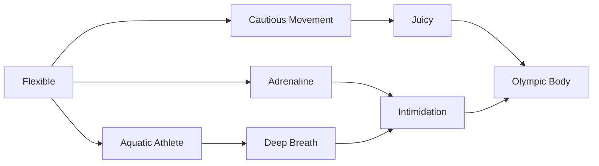

- **Flexible.** Advantage to escape Pinned status.
- **Adrenaline.** Rush of 30% Stamina when less than 10%.
- **Aquatic Athlete.** +50% swimming speed.
- **Cautious Movement.** −30% sneak penalty from armour.
- **Deep Breath.** Daily advantage on Athleticism contest.
- **Juicy.** −1 to anal tightness adjustments.
- **Intimidation.** Sorcery of enemies 3 levels lower, reduced by 30%.
- **Olympic Body.** 9% extra Athleticism growth.

### Alchemy

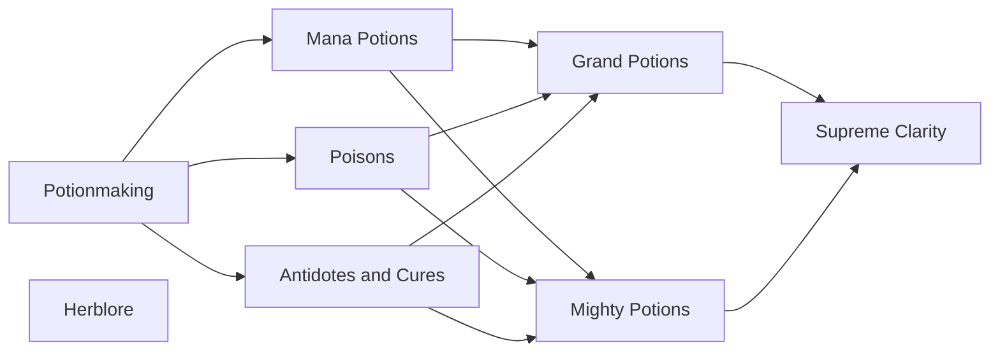

- **Potionmaking.** Base potion crafting.
- **Mana Potions.** Brew Mana potions.
- **Antidotes and Cures.** Brew antidotes and cures.
- **Poisons.** Brew poisons.
- **Grand Potions.** Larger.
- **Mighty Potions.** Stronger.
- **Supreme Clarity.** Gain 200% Mana from potions.
- **Herblore.** Identify ingredients in the wild.

### Allure

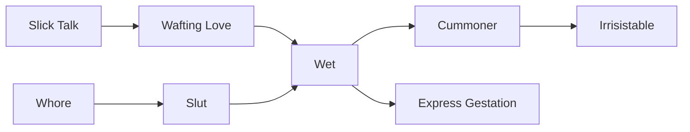

- **Slick Talk.** Bonus to Charisma when target has less than 80% yours.
- **Wafting Love.** Bonus on charm spells.
- **Whore.** Increase material value of your body.
- **Slut.** 5% bonus XP for every additional sex partner.
- **Wet.** −1 to pussy tightness adjustments.
- **Cummoner.** Mana regenerates from sex.
- **Express Gestation.** Shortens bred status by 2/3.
- **Irresistible.** Automatic allure attacks vs observers.

### Arcanery

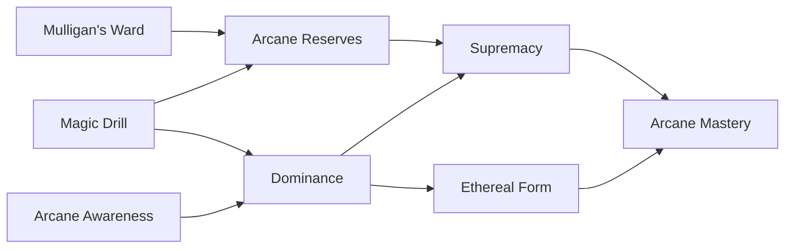

- **Mulligan's Ward.** Daily spell re-roll.
- **Magic Drill.** Reduce spell Mana costs by 15%.
- **Arcane Awareness.** Passively detect magic in the vicinity.
- **Arcane Reserves.** Rush of 30% Mana when less than 10%.
- **Dominance.** Spells cost an additional 35% less against a target 5 levels lower.
- **Supremacy.** Bonus against non-magic enemies (−5 Sorcery).
- **Ethereal Form.** Gain the Ethereal trait, unable to be harmed by physical attacks.
- **Arcane Mastery.** Remove cost penalties for one additional school of magic.

### Beast Tamer

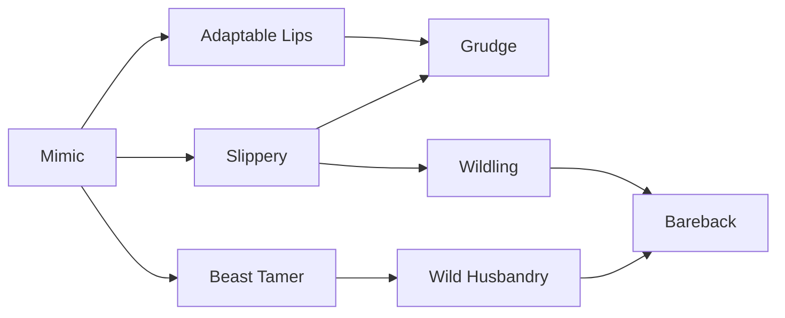

- **Mimic.** Call out to beasts in their own voice to draw them near.
- **Adaptable Lips.** Resistance to being Knotted.
- **Slippery.** Resistance to Writhing creatures.
- **Beast Tamer.** May pacify beasts and reduce stats by 10%.
- **Grudge.** Gain resistance vs last creature to defeat you.
- **Wildling.** Bonus to Athleticism in wilderness.
- **Wild Husbandry.** May tame pacified beasts to use at camp.
- **Bareback.** May ride certain beasts without a saddle.

### Blessing

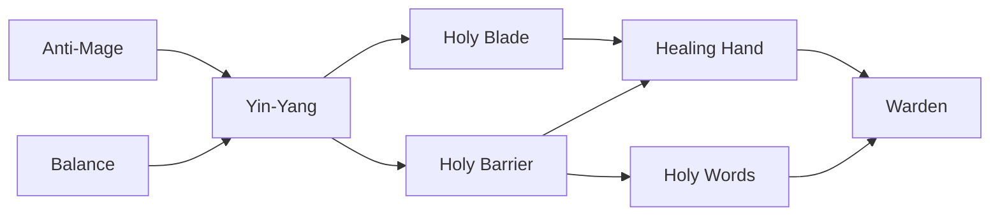

- **Anti-Mage.** Magic resistance.
- **Balance.** Bonus to Willpower contests.
- **Yin-Yang.** Resting restores both Mana and Resolve.
- **Holy Blade.** Deal 25% damage through Ethereal trait.
- **Holy Barrier.** Touch and handle elemental forms.
- **Healing Hand.** May cast _mend_ using Resolve.
- **Holy Words.** May cast _blink_ using Resolve.
- **Warden.** Grants short term magic immunity once per day.

### Brawn

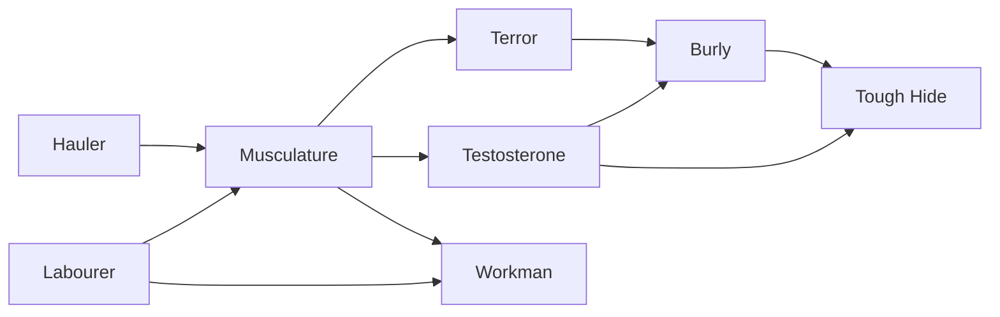

- **Hauler.** Increase Equip Load by 4.
- **Labourer.** Increase gathering yield by 20%.
- **Musculature.** Allure bonus against humanoids.
- **Terror.** Physical attacks deal Resolve damage.
- **Testosterone.** +3 on Impregnate roll.
- **Workman.** Construct 20% faster.
- **Burly.** Bonus to pinning attacks.
- **Tough Hide.** Physical resistance.

### Hardiness

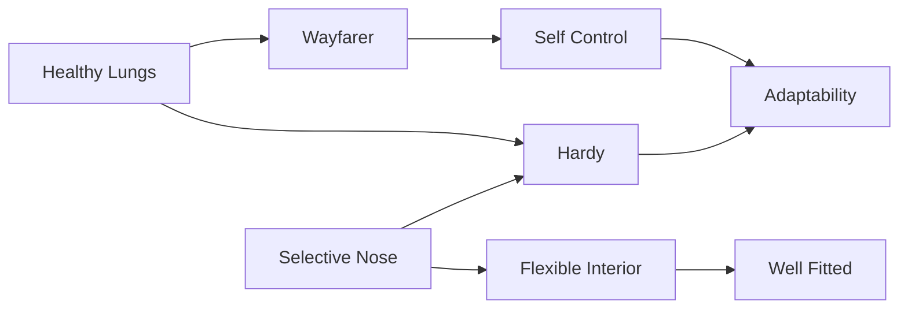

- **Healthy Lungs.** 50% more time without breath.
- **Selective Nose.** Resistance against inhaled conditions.
- **Wayfarer.** Consume 25% less food while traveling.
- **Hardy.** 30% extra Stamina.
- **Flexible Interior.** −1 to all tightness adjustments.
- **Self Control.** Addiction escalates only 50% as fast.
- **Well Fitted.** −25% weight of armours when worn.
- **Adaptability.** Immune to one status effect entirely.

### Hunting

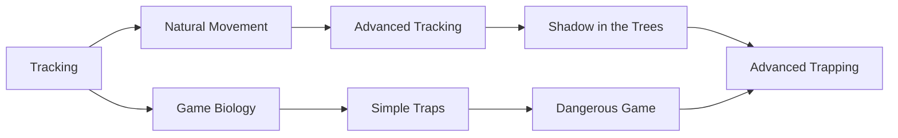

- **Tracking.** Follow tracks and other clues to find.
- **Natural Movement.** Bonus to stealth in wilderness.
- **Game Biology.** +40% food yield per animal.
- **Advanced Tracking.** Bonus to tracking.
- **Simple Traps.** Set up rudimentary pitfalls to catch game.
- **Shadow in the Trees.** Bonus to any hunting attack when hidden.
- **Dangerous Game.** Prepare dangerous and poisonous game.
- **Advanced Trapping.** Set up improved traps and trap larger game.

### Mana

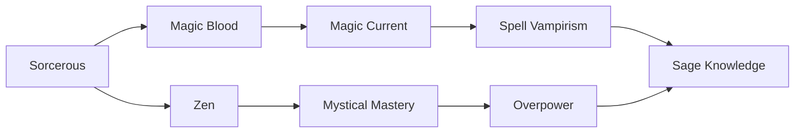

- **Sorcerous.** 30% extra Mana.
- **Magic Blood.** Magic resistance.
- **Zen.** Resting restores 200% more Mana.
- **Magic Current.** Mana regenerates passively.
- **Mystical Mastery.** Bonus to two spells cast per day.
- **Spell Vampirism.** Gain 15% Mana pool of enemies.
- **Overpower.** Bonus when casting any spell that must double out.
- **Sage Knowledge.** Remove cost penalties for one additional school of magic.

### Purity

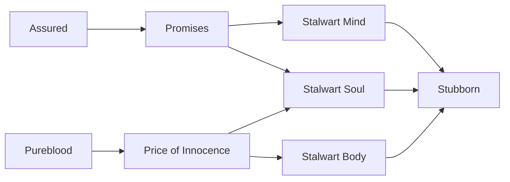

- **Assured.** Daily advantage on Willpower contests.
- **Pureblood.** Resistance to poisons and toxins.
- **Promises.** 30% extra Resolve.
- **Price of Innocence.** Physical resistance, charm weakness.
- **Stalwart Mind.** Resistance to Mind Flay.
- **Stalwart Soul.** Resistance to Addiction.
- **Stalwart Body.** −2 to all tightness adjustments.
- **Stubborn.** Bonus to Willpower when target has less than 80% yours.

### Thrift

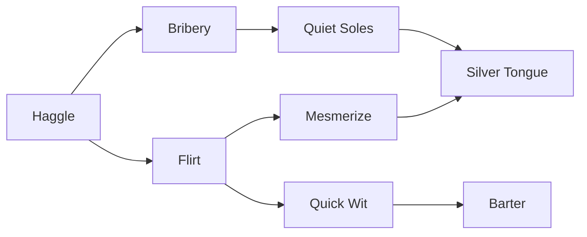

- **Haggle.** Reduction in prices.
- **Bribery.** May bribe guards.
- **Flirt.** Bonus on charming humanoids.
- **Quiet Soles.** Stealth advantage within towns.
- **Mesmerize.** Gain a price reduction if merchant is allured.
- **Quick Wit.** Advantage on Charisma contests.
- **Silver Tongue.** 9% extra Charisma growth.
- **Barter.** Able to sell items for more.

## Spell Trees

### Alteration

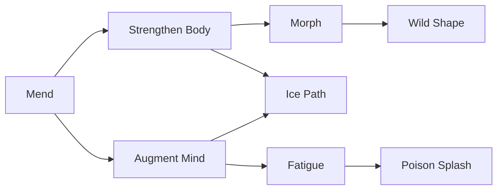

### Enchanting

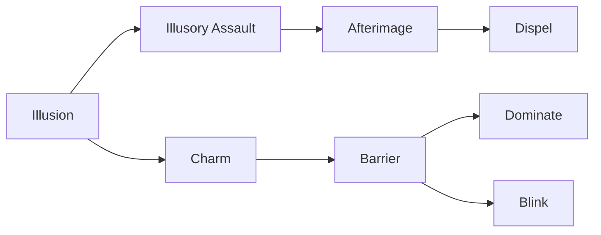

### Invocation

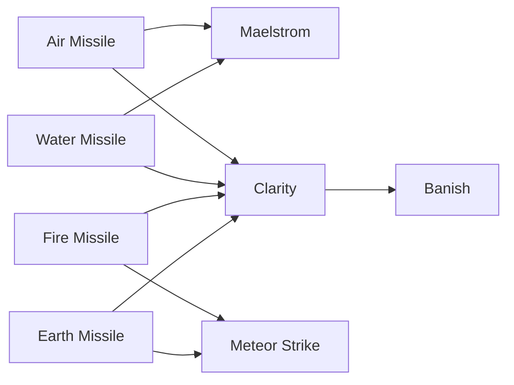

### Purification

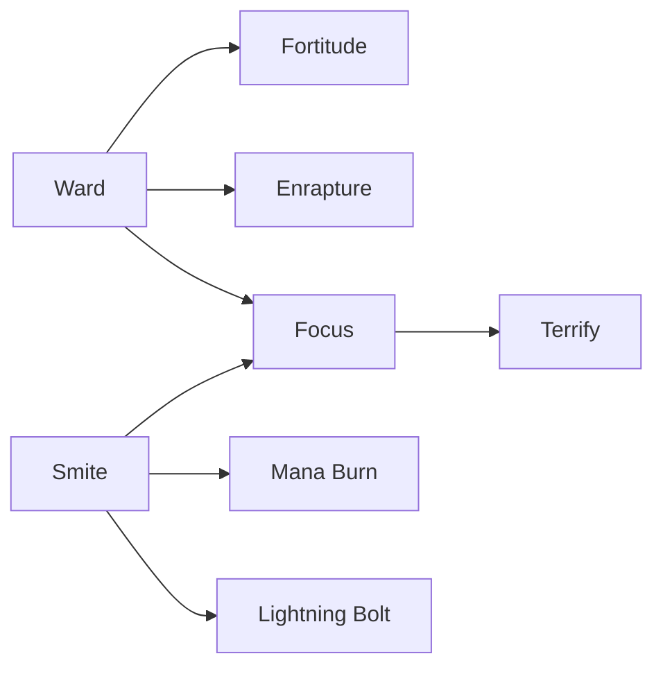

### Summoning

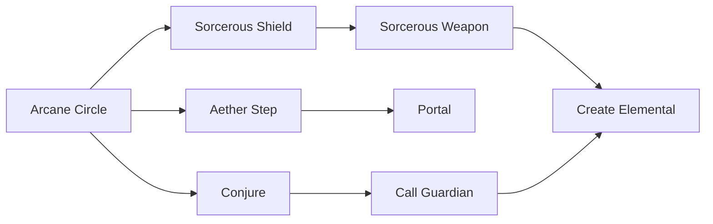

## Equipment

### Materials

| Material               | Weapon or Armour | Upgrade Cap | Base Weight | Durability (Rounds) |
| ---------------------- | ---------------- | ----------- | ----------- | ------------------- |
| Wood Weapons           | Only             | 1           | 1.0         | 15                  |
| Hide Armour            | Only             | 3           | 1.4         | 30                  |
| Stone Weapons          | Only             | 3           | 1.4         | 30                  |
| Bone Weapons           | Only             | 3           | 1.1         | 20                  |
| Leather & Shale        | Both             | 6           | 1.1         | 20                  |
| Copper                 | Both             | 6           | 1.4         | 30                  |
| Iron                   | Both             | 6           | 1.5         | 35                  |
| Hardleather & Obsidian | Both             | 9           | 1.1         | 20                  |
| Bronze                 | Both             | 9           | 1.4         | 30                  |
| Steel                  | Both             | 9           | 1.5         | 35                  |
| Crystal                | Both             | Asc         | 1.0         | 15                  |
| Orichalcum             | Both             | Asc         | 1.1         | 20                  |
| Mithrill               | Both             | Asc         | 1.3         | 25                  |
| Aragonite              | Both             | Asc         | 1.4         | 30                  |
| Gorgonite              | Both             | Asc         | 1.5         | 35                  |
| Adamantite             | Both             | Asc         | 1.7         | 40                  |

### Armour Archetypes

| Armours   | Bonuses (+10%)         | Maluses (−same val.)           | Weight Multiplier |
| --------- | ---------------------- | ------------------------------ | ----------------- |
| Mundane   | —                      | —                              | 5.0               |
| Martial   | Athleticism            | Sorcery                        | 5.0               |
| Wanderer  | Endurance              | Willpower                      | 4.5               |
| Risqué    | Charisma               | Athleticism                    | 4.5               |
| Arcane    | Sorcery                | Charisma                       | 5.0               |
| Stoic     | Willpower              | Endurance                      | 5.5               |
| Plate     | +1 Defence             | Athleticism, Charisma, Sorcery | 5.5               |
| Barbarian | +1 Attack, Endurance   | −1 Defence                     | 4.5               |
| Rogue     | Sneaking bonus         | Athleticism (−5%)              | 4.5               |
| Monk      | Athleticism, Willpower | Sorcery, Endurance             | 5.0               |
| Eldritch  | Athleticism, Sorcery   | Willpower, Endurance           | 5.5               |
| Druidic   | Endurance, Sorcery     | Athleticism, Willpower         | 5.0               |
| Valkyrie  | Charisma, Athleticism  | Willpower, Sorcery             | 5.5               |
| Mesmer    | Charisma, Sorcery      | Athleticism, Willpower         | 5.0               |

### Weapon Archetypes

| Weapons | Bonuses (+10%)                                         | Maluses (−same val.) | Weight Multiplier |
| ------- | ------------------------------------------------------ | -------------------- | ----------------- |
| Great   | Athleticism                                            | Endurance            | 2.5               |
| Medium  | —                                                      | —                    | 2.0               |
| Small   | Endurance                                              | Athleticism          | 1.5               |
| Ranged  | Ranged attacks                                         | Athleticism          | 1.5               |
| Dual    | Bonus die                                              | Athleticism          | 2.5               |
| Magical | Sorcery                                                | Athleticism          | 2.0               |
| Holy    | Ignores Ethereal and Elemental traits, bonus vs demons | Athleticism          | 2.0               |
